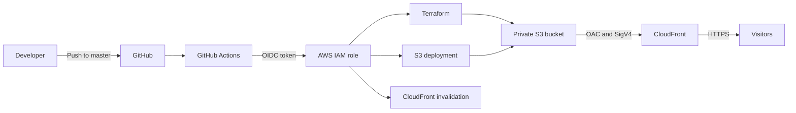

# AWS Cloud Resume Portfolio

A cloud engineering portfolio for Charles Opuba, hosted on AWS and managed with Terraform.

The site is delivered globally through Amazon CloudFront from a private Amazon S3 origin. GitHub Actions uses OpenID Connect (OIDC) to obtain temporary AWS credentials, deploy website updates, and invalidate the CloudFront cache without storing long-lived AWS access keys.

[View the live portfolio](https://d7kla1ca2zt2q.cloudfront.net)

## What This Project Demonstrates

- Infrastructure as code with Terraform
- Private S3 origin secured with CloudFront Origin Access Control (OAC)
- HTTPS delivery through CloudFront
- Automated deployments with GitHub Actions
- Keyless AWS authentication through GitHub OIDC
- Responsive and accessible frontend development
- Practical AWS security and operational troubleshooting

## Architecture



### Request Flow

1. A visitor requests the portfolio through the CloudFront URL.
2. CloudFront serves a cached response when one is available.
3. For an origin request, CloudFront signs the request using OAC and retrieves the object from the private S3 bucket.
4. The S3 bucket policy permits reads only from the designated CloudFront distribution.

The S3 bucket blocks public access. Visitors interact with CloudFront rather than accessing the bucket directly.

## AWS Services

| Service | Purpose |
|---|---|
| Amazon S3 | Stores the static website files in a private, versioned bucket |
| Amazon CloudFront | Provides HTTPS, edge caching, and global content delivery |
| AWS IAM | Controls CloudFront origin access and GitHub Actions permissions |
| AWS STS and OIDC | Issues temporary credentials to GitHub Actions |
| Terraform | Defines and manages the AWS infrastructure |

AWS pricing and free-tier allowances can change. Review the current AWS pricing pages and configure a budget alert before deploying resources.

## Repository Structure

```text
aws-cloud-resume/
|-- .github/
|   `-- workflows/
|       `-- deploy.yml          # Terraform and website deployment workflow
|-- website/
|   |-- assets/                 # Certification and training images
|   |-- index.html              # Portfolio content and structure
|   |-- main.css                # Core visual design and responsive layout
|   |-- experience.css          # Professional experience section styles
|   |-- animations.css          # Motion and reduced-motion behavior
|   `-- app.js                  # Navigation, active sections, and reveal effects
|-- main.tf                     # S3, CloudFront, OAC, and bucket policy
|-- variables.tf                # Terraform input variables
|-- outputs.tf                  # Deployment outputs
|-- versions.tf                 # Terraform and AWS provider requirements
|-- terraform.tfvars.example    # Example input values
|-- .gitignore
`-- README.md
```

## Frontend Features

- Responsive layout for desktop, tablet, and mobile screens
- Semantic page structure and accessible navigation
- Keyboard-accessible skip link and mobile menu
- Scroll-based section highlighting
- Staggered content reveals and restrained hover effects
- Reduced-motion support through `prefers-reduced-motion`
- Project case studies, professional experience, credentials, and contact links

## Security Design

### Private S3 Origin

S3 Block Public Access is enabled. The bucket is not configured as a public website endpoint and does not permit anonymous reads.

### CloudFront Origin Access Control

CloudFront OAC signs origin requests with AWS Signature Version 4. The bucket policy restricts `s3:GetObject` access to the ARN of the portfolio CloudFront distribution.

### HTTPS

CloudFront redirects HTTP requests to HTTPS. The current deployment uses the default CloudFront certificate and domain.

### GitHub OIDC

The deployment workflow does not require stored AWS access keys. GitHub presents a short-lived OIDC token, AWS validates its repository and branch claims, and AWS STS returns temporary credentials for the workflow run.

The GitHub OIDC provider, trust policy, deployment role, and permissions are prerequisites managed outside the Terraform configuration in this repository.

## Local Deployment

### Prerequisites

- Terraform 1.6 or later
- AWS CLI configured with an authorized AWS identity
- An AWS account with permission to manage S3 and CloudFront resources

### Configure Terraform

```bash
git clone https://github.com/Copubah/aws-cloud-resume.git
cd aws-cloud-resume
cp terraform.tfvars.example terraform.tfvars
```

Review `terraform.tfvars` and choose a globally unique S3 bucket name before continuing.

### Provision the Infrastructure

```bash
terraform init
terraform fmt -check
terraform validate
terraform plan
terraform apply
```

Terraform returns the S3 bucket name, CloudFront distribution ID, and live CloudFront URL.

### Publish the Website

```bash
aws s3 sync website/ s3://YOUR_BUCKET_NAME/ \
  --delete \
  --cache-control "no-cache, no-store, must-revalidate"
```

### Refresh CloudFront

```bash
aws cloudfront create-invalidation \
  --distribution-id YOUR_DISTRIBUTION_ID \
  --paths "/*"
```

## Continuous Deployment

Pushes to `master` trigger `.github/workflows/deploy.yml`. The workflow:

1. Checks out the repository.
2. Authenticates to AWS through OIDC.
3. installs the configured Terraform version.
4. Runs `terraform init`, formatting checks, validation, and planning.
5. Applies the Terraform configuration.
6. Synchronizes `website/` with the S3 bucket.
7. Invalidates the CloudFront distribution.
8. Prints the deployed CloudFront URL.

The workflow requires one GitHub Actions secret:

| Secret | Description |
|---|---|
| `AWS_DEPLOY_ROLE_ARN` | ARN of the IAM role trusted by the repository's GitHub OIDC identity |

### Terraform State Warning

This repository currently uses local Terraform state, and state files are intentionally excluded from Git. GitHub-hosted runners are temporary and do not retain local state between workflow runs.

Before relying on GitHub Actions to modify infrastructure, configure a remote Terraform backend with state locking. Until then, infrastructure changes should be applied from the environment holding the current state, while the workflow can be limited to validation and website deployment.

## Cache Behavior

Website files are deployed with `no-cache, no-store, must-revalidate`. This prevents browsers from retaining an outdated version after a deployment. CloudFront is also invalidated after each successful upload.

For a higher-traffic production site, a better optimization would be:

- Short or no caching for `index.html`
- Long caching for versioned CSS, JavaScript, and image filenames
- Content hashes in asset filenames

## Troubleshooting

### CloudFront Returns 403

Confirm that:

- S3 Block Public Access remains enabled.
- The bucket policy allows the CloudFront service principal to call `s3:GetObject`.
- The policy `AWS:SourceArn` matches the deployed distribution ARN.
- The distribution uses the correct OAC and S3 regional endpoint.

### GitHub OIDC Authentication Fails

Confirm that:

- The IAM OIDC provider URL is `https://token.actions.githubusercontent.com`.
- The audience is `sts.amazonaws.com`.
- The trust policy subject matches `repo:Copubah/aws-cloud-resume:ref:refs/heads/master`.
- `AWS_DEPLOY_ROLE_ARN` contains the correct role ARN.

### The Live Site Shows an Older Version

Check the S3 object metadata and CloudFront invalidation status. Redeploy with the documented cache-control header, invalidate `/*`, and verify the response headers from the CloudFront URL.

### Terraform Reports Existing Resources

Run Terraform only with the state that manages the deployed resources. If a resource exists outside the active state, import it instead of attempting to recreate it. For example:

```bash
terraform import aws_s3_bucket.portfolio YOUR_BUCKET_NAME
```

Review the import plan carefully before applying changes.

## Planned Improvements

- Configure a remote Terraform backend and state locking
- Commit and maintain the Terraform dependency lock file
- Add automated HTML, CSS, accessibility, and link checks
- Add CloudFront security headers through a response headers policy
- Add CloudWatch monitoring and cost alerts
- Add a custom domain and ACM certificate
- Introduce versioned static assets for efficient long-term caching

## Author

Charles Opuba, Cloud and Production Support Engineer

- [LinkedIn](https://www.linkedin.com/in/charles-opuba-94820574/)
- [GitHub](https://github.com/Copubah)
- Email: [charlesopuba@gmail.com](mailto:charlesopuba@gmail.com)

Built on AWS, managed with Terraform, and deployed through GitHub Actions.
