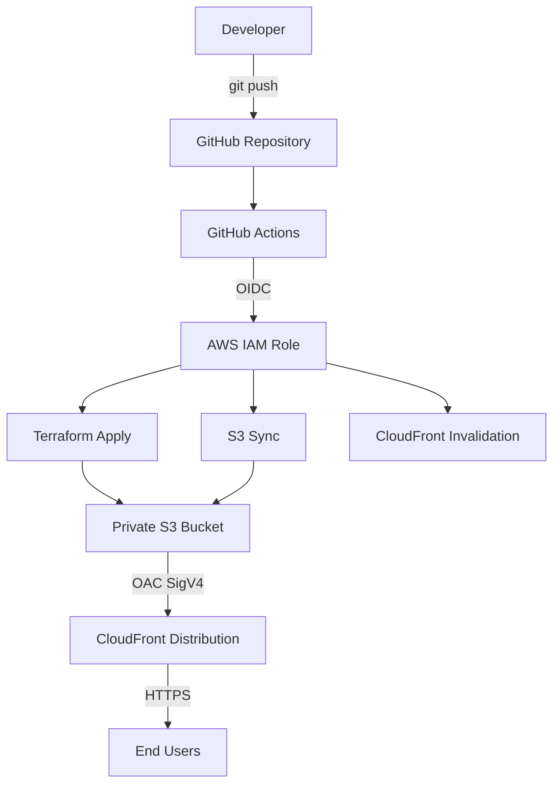
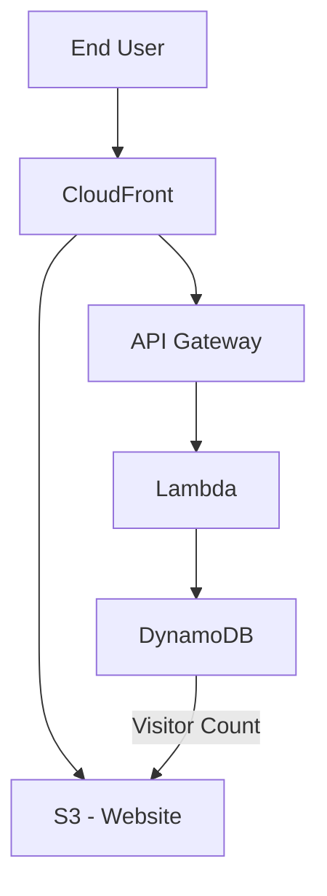

# AWS Cloud Resume Challenge

A professional cloud engineering portfolio for Charles Opuba, built as part of the AWS Cloud Resume Challenge.

The website is hosted on a private S3 bucket and served globally through CloudFront with HTTPS, provisioned entirely with Terraform and deployed automatically via GitHub Actions using OIDC authentication.

Live site: https://xxxxxxxxxxxx.cloudfront.net (URL is output after terraform apply)

---

## Project Overview

This project demonstrates production-style AWS cloud engineering skills including:

- Infrastructure as Code with Terraform
- Secure S3 and CloudFront architecture
- CI/CD with GitHub Actions and OIDC (no long-lived credentials)
- AWS security best practices
- FinOps and cost-awareness
- AWS Solutions Architect Associate preparation

---

## Architecture

### Current Architecture

```
Developer (local)
        |
        v
GitHub Repository
        |
        v
GitHub Actions
        |
   OIDC Token
        |
        v
AWS IAM Role (temporary credentials)
        |
   +----+----+
   |         |
   v         v
Terraform   S3 Sync + CloudFront Invalidation
   |
   v
Private S3 Bucket <---- CloudFront (OAC + SigV4)
                                |
                           HTTPS only
                                |
                           End Users
```

### Architecture Diagram



### Planned Future Architecture



---

## AWS Services Used

| Service | Purpose | Cost Consideration |
|---|---|---|
| S3 | Private static website file storage | Low - storage + request costs |
| CloudFront | Global CDN, HTTPS, caching | Low - free tier 1TB/month |
| IAM | OIDC role for GitHub Actions | Free |
| GitHub Actions | CI/CD pipeline | Free for public repos |

Future services:

| Service | Purpose |
|---|---|
| API Gateway | Visitor counter API endpoint |
| Lambda | Visitor count logic |
| DynamoDB | Visitor count storage |
| CloudWatch | Monitoring and alerting |

---

## Project Structure

```
aws-cloud-resume/
├── main.tf                         # S3, CloudFront, OAC, bucket policy
├── variables.tf                    # Input variables
├── outputs.tf                      # CloudFront URL, bucket name, distribution ID
├── versions.tf                     # Terraform and provider version constraints
├── terraform.tfvars.example        # Example variable values (safe to commit)
├── website/
│   ├── index.html                  # Portfolio page
│   ├── main.css                    # Styles
│   ├── app.js                      # Navigation logic
│   └── assets/                     # Certification badge images
├── .github/
│   └── workflows/
│       └── deploy.yml              # GitHub Actions CI/CD pipeline
├── .gitignore                      # Excludes secrets, state files, .terraform/
└── README.md
```

---

## Security Architecture

### Why S3 is Private

The S3 bucket has full public access blocked. Users cannot access S3 directly. This prevents:

- Direct hotlinking to bucket files
- Bypassing CloudFront (and its security features)
- Accidental exposure of files not intended to be public

### Why CloudFront is the Public Entry Point

CloudFront sits in front of S3 and is the only entity allowed to read from the bucket. This provides:

- HTTPS everywhere (redirect-to-https enforced)
- Global caching and low latency via edge locations
- A single, controlled entry point

### Why Origin Access Control (OAC)

OAC uses SigV4 request signing so that only the specific CloudFront distribution can fetch objects from the S3 bucket. The bucket policy enforces this using `AWS:SourceArn` to restrict access to this distribution only.

### Why GitHub OIDC Instead of Long-Lived Credentials

Long-lived AWS access keys stored in GitHub Secrets are a security risk. If the secret is leaked, an attacker has persistent access to your AWS account.

GitHub OIDC works differently:

1. GitHub generates a short-lived cryptographic token for each workflow run.
2. AWS IAM verifies the token against GitHub's OIDC provider.
3. AWS issues temporary credentials that expire after the workflow run.
4. No AWS credentials are ever stored in GitHub Secrets.

The IAM trust policy restricts which GitHub repository and branch can assume the role, limiting the blast radius if anything goes wrong.

---

## Terraform Structure

### versions.tf

Pins the Terraform version and AWS provider version to ensure consistent behavior across environments.

### variables.tf

Declares input variables for region and bucket name so no values are hard-coded in the configuration.

### main.tf

Provisions:
- S3 bucket with ownership controls, public access block, and versioning
- CloudFront Origin Access Control with SigV4 signing
- IAM policy document granting CloudFront read access to S3
- S3 bucket policy applying the IAM document
- CloudFront distribution with HTTPS redirect, caching, and 404 error handling

### outputs.tf

Outputs:
- `cloudfront_url` - the HTTPS URL to access the website
- `s3_bucket_name` - the bucket name (used in deployment scripts)
- `cloudfront_distribution_id` - used for cache invalidation

---

## GitHub Actions CI/CD Pipeline

File: `.github/workflows/deploy.yml`

### Workflow Steps

1. Checkout repository
2. Authenticate to AWS via GitHub OIDC (no stored credentials)
3. Setup Terraform
4. `terraform init`
5. `terraform fmt -check`
6. `terraform validate`
7. `terraform plan`
8. `terraform apply`
9. `aws s3 sync` - deploy website files to S3
10. CloudFront cache invalidation
11. Print CloudFront URL

### Required GitHub Secret

Only one secret is required:

| Secret | Value |
|---|---|
| `AWS_DEPLOY_ROLE_ARN` | ARN of the IAM role GitHub Actions will assume via OIDC |

No AWS access keys or secret keys are stored in GitHub Secrets.

---

## Deployment Instructions

### Prerequisites

- Terraform >= 1.6 installed
- AWS CLI installed and configured (`aws configure`)
- AWS account with appropriate IAM permissions

### Phase 1 - Initial Manual Deployment

```bash
# Clone the repository
git clone https://github.com/Copubah/aws-cloud-resume
cd aws-cloud-resume

# Copy the example variables file
cp terraform.tfvars.example terraform.tfvars

# Initialize Terraform
terraform init

# Format check
terraform fmt

# Validate configuration
terraform validate

# Preview changes
terraform plan

# Apply infrastructure
terraform apply
```

After apply, Terraform will output the CloudFront URL.

### Phase 2 - Deploy Website Files

```bash
aws s3 sync website/ s3://opubacharles-portfolio-623244137074/ --delete
```

### Phase 3 - Invalidate CloudFront Cache

```bash
aws cloudfront create-invalidation \
  --distribution-id YOUR_DISTRIBUTION_ID \
  --paths "/*"
```

### Phase 4 - Setup GitHub Actions OIDC

Before GitHub Actions can deploy automatically, you need to create an IAM role in AWS that trusts GitHub's OIDC provider.

#### Step 1 - Add GitHub as an OIDC Identity Provider in AWS IAM

In the AWS Console, go to IAM > Identity providers > Add provider:

- Provider type: OpenID Connect
- Provider URL: `https://token.actions.githubusercontent.com`
- Audience: `sts.amazonaws.com`

#### Step 2 - Create the IAM Deployment Role

Create an IAM role with the following trust policy (replace with your GitHub username and repo):

```json
{
  "Version": "2012-10-17",
  "Statement": [
    {
      "Effect": "Allow",
      "Principal": {
        "Federated": "arn:aws:iam::623244137074:oidc-provider/token.actions.githubusercontent.com"
      },
      "Action": "sts:AssumeRoleWithWebIdentity",
      "Condition": {
        "StringEquals": {
          "token.actions.githubusercontent.com:aud": "sts.amazonaws.com",
          "token.actions.githubusercontent.com:sub": "repo:Copubah/aws-cloud-resume:ref:refs/heads/master"
        }
      }
    }
  ]
}
```

#### Step 3 - Attach a Permissions Policy to the Role

The role needs the following minimum permissions:

```json
{
  "Version": "2012-10-17",
  "Statement": [
    {
      "Sid": "S3Deploy",
      "Effect": "Allow",
      "Action": [
        "s3:PutObject",
        "s3:GetObject",
        "s3:DeleteObject",
        "s3:ListBucket"
      ],
      "Resource": [
        "arn:aws:s3:::opubacharles-portfolio-623244137074",
        "arn:aws:s3:::opubacharles-portfolio-623244137074/*"
      ]
    },
    {
      "Sid": "CloudFrontInvalidation",
      "Effect": "Allow",
      "Action": [
        "cloudfront:CreateInvalidation",
        "cloudfront:ListDistributions",
        "cloudfront:GetDistribution"
      ],
      "Resource": "*"
    },
    {
      "Sid": "TerraformStateAndInfra",
      "Effect": "Allow",
      "Action": [
        "s3:*",
        "cloudfront:*",
        "iam:GetRole",
        "iam:PassRole"
      ],
      "Resource": "*"
    }
  ]
}
```

#### Step 4 - Add the Role ARN to GitHub Secrets

In your GitHub repository, go to Settings > Secrets and variables > Actions:

- Name: `AWS_DEPLOY_ROLE_ARN`
- Value: `arn:aws:iam::623244137074:role/YOUR_ROLE_NAME`

---

## AWS Cost Considerations

This project is designed to remain within or very close to AWS Free Tier limits.

### Current Architecture Costs

| Service | Free Tier | Expected Usage | Estimated Cost |
|---|---|---|---|
| S3 Storage | 5 GB free | < 10 MB | Free |
| S3 Requests | 20,000 GET free | Low | Free |
| CloudFront | 1 TB transfer free | Very low | Free |
| CloudFront Requests | 10M requests free | Very low | Free |
| IAM | Always free | - | Free |

### Cost Monitoring Recommendations

Use these AWS tools to monitor and control costs:

- AWS Budgets: Set a monthly budget alert (e.g., $5) to get notified before unexpected charges
- AWS Cost Explorer: Visualize spending by service and time period
- AWS Cost Anomaly Detection: Get automatic alerts when spending deviates from normal patterns
- AWS Cost Optimization Hub: View recommendations for unused or underutilized resources
- AWS Compute Optimizer: Relevant when Lambda is added in the visitor counter phase

### Resources That Can Incur Costs

- CloudFront: Data transfer out beyond 1 TB/month
- S3: Storage beyond 5 GB, or very high request volumes
- Lambda (future): Invocations beyond 1M/month free tier
- API Gateway (future): Beyond 1M calls/month free tier
- DynamoDB (future): Beyond 25 GB storage and 25 WCU/RCU free tier
- CloudWatch (future): Log ingestion and storage beyond free tier

---

## Future Improvements

### Phase 6 - Visitor Counter

Add a real-time visitor counter using:

- JavaScript fetch call from the portfolio page
- API Gateway HTTP endpoint
- Lambda function (Python)
- DynamoDB table for storing the count

### Phase 7 - CloudWatch Monitoring

Add monitoring for:

- Lambda errors and invocations
- API Gateway 4xx/5xx errors
- CloudFront cache hit rate
- Cost anomaly alerts

### Phase 8 - Terraform Remote State

Move Terraform state to an S3 backend with DynamoDB state locking for team-safe deployments.

---

## Troubleshooting

### CloudFront returns 403 on S3 objects

Check that:
- The S3 bucket policy grants `s3:GetObject` to `cloudfront.amazonaws.com`
- The `AWS:SourceArn` condition matches the correct CloudFront distribution ARN
- The OAC is attached to the correct origin in the distribution

### GitHub Actions OIDC authentication fails

Check that:
- The IAM OIDC identity provider URL matches exactly: `https://token.actions.githubusercontent.com`
- The audience is `sts.amazonaws.com`
- The trust policy `sub` condition matches the correct repo and branch

### Terraform plan fails with bucket already exists

The S3 bucket name must be globally unique. If the bucket was previously created outside of Terraform, import it:

```bash
terraform import aws_s3_bucket.portfolio opubacharles-portfolio-623244137074
```

### CloudFront cache not updating after deployment

Run a cache invalidation:

```bash
aws cloudfront create-invalidation \
  --distribution-id YOUR_DISTRIBUTION_ID \
  --paths "/*"
```

---

## Author

Charles Opuba - Cloud Support Engineer

- LinkedIn: [charles-opuba-94820574](https://www.linkedin.com/in/charles-opuba-94820574/)
- GitHub: [@Copubah](https://github.com/Copubah)

---

Built on AWS. Managed with Terraform. Deployed with GitHub Actions.
